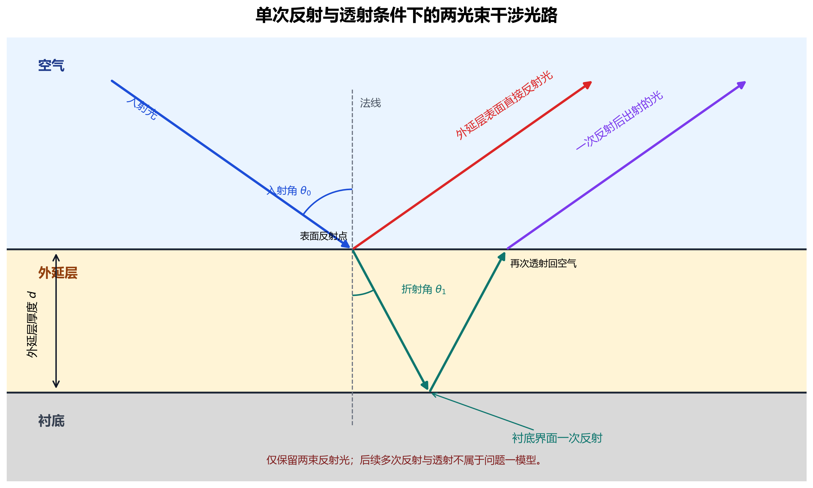
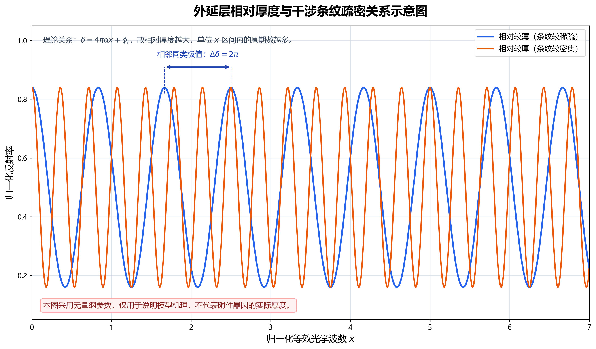

# 问题一 模型的建立

## 1. 两光束干涉模型

问题一只考虑两束反射光：一束在空气—外延层界面直接反射，另一束进入外延层，在外延层—衬底界面反射一次后再透射回空气。二者沿平行方向出射，但传播路径不同，由此形成随波数变化的相位差。模型的关键不在于拟合反射率的整体起伏，而在于建立条纹相位与外延层厚度之间的对应关系。

将空气、外延层和衬底视为三层平行介质，如图 1 所示。设外延层厚度为 $d$，空气折射率为 $n_0$，通常可近似取 $n_0=1$；外延层折射率写成波数的函数 $n(\sigma)$，其中 $\sigma=1/\lambda$，$\lambda$ 为真空波长。入射角和膜内折射角分别记为 $\theta_0$、$\theta_1$。建模时认为外延层在测量区域内厚度均匀，材料均匀且各向同性；各波数分量可分别看作单色平面波；吸收和散射主要改变条纹振幅，不改变主导相位。仪器噪声、背景漂移及其余未建模因素统一归入误差项。后续多次反射不在本问考虑范围内。

## 2. 折射角与有效光程差

由于折射率随波数变化，膜内折射角也随 $\sigma$ 改变。由斯涅尔定律可得

$$
n_0\sin\theta_0=n(\sigma)\sin\theta_1,
\qquad
n(\sigma)\cos\theta_1
=\sqrt{n^2(\sigma)-n_0^2\sin^2\theta_0}.
\tag{1}
$$

式（1）消去了难以直接测量的 $\theta_1$，使后续模型只保留实验给定的入射角与材料折射率。

第二束光在外延层内往返一次，其膜内几何路程为 $2d/\cos\theta_1$。这一长度不能直接作为两束出射光的光程差，因为两束光的出射点存在横向错位，比较相位时应选取同一出射波前。横向位移为 $2d\tan\theta_1$，对应的外部传播光程需要从膜内光程中扣除。因此

$$
\begin{aligned}
\Delta L
&=\frac{2n(\sigma)d}{\cos\theta_1}
-2n_0d\tan\theta_1\sin\theta_0 \\
&=2n(\sigma)d\cos\theta_1 \\
&=2d\sqrt{n^2(\sigma)-n_0^2\sin^2\theta_0}.
\end{aligned}
\tag{2}
$$

式（2）说明，薄膜干涉中的有效光程差含 $\cos\theta_1$，而不是 $1/\cos\theta_1$。前者来自同一波前上的相位比较，后者只描述第二束光在膜内走过的几何路程。

## 3. 相位差与反射率模型

传播光程产生的相位差为 $\delta_p=(2\pi/\lambda)\Delta L$。两个界面的反射还可能带来半波损失，记两束光的相对反射附加相位为 $\phi_r$，则总相位差写为

$$
\delta(\sigma)
=4\pi d\sigma
\sqrt{n^2(\sigma)-n_0^2\sin^2\theta_0}
+\phi_r.
\tag{3}
$$

$\phi_r$ 由两个界面的折射率关系决定。在理想无吸收介质中，它通常取 $0$ 或 $\pi$。该相位会改变峰、谷所对应的绝对干涉级次；若其在研究波段内保持不变，则对相邻同类极值作差时可以消去。

设两束反射光的强度分别为 $I_1(\sigma)$ 和 $I_2(\sigma)$。依据相干光叠加原理，合成光强满足

$$
I(\sigma)=I_1(\sigma)+I_2(\sigma)
+2\sqrt{I_1(\sigma)I_2(\sigma)}\cos\delta(\sigma).
\tag{4}
$$

将非振荡背景、菲涅耳系数和传播衰减等缓慢变化因素分别并入背景项 $A(\sigma)$ 与振幅包络 $B(\sigma)$，实测反射率可表示为

$$
R(\sigma)=A(\sigma)+B(\sigma)
\cos\!\left[
4\pi d\sigma\sqrt{n^2(\sigma)-n_0^2\sin^2\theta_0}
+\phi_r
\right]+\varepsilon(\sigma),
\tag{5}
$$

其中，$\varepsilon(\sigma)$ 表示测量噪声及模型误差。$A(\sigma)$ 和 $B(\sigma)$ 影响条纹的基线与可见度，余弦项决定峰谷位置。式（5）只包含两束光，不引入多光束干涉的 Airy 形式。

## 4. 等效光学波数与厚度反演

若直接在原始波数轴上处理条纹，$n(\sigma)$ 的色散会使相邻条纹间距不再严格相等。为保留这一影响，定义等效光学波数

$$
x(\sigma,\theta_0)
=\sigma\sqrt{n^2(\sigma)-n_0^2\sin^2\theta_0},
\qquad
\delta=4\pi d x+\phi_r.
\tag{6}
$$

在 $x$ 坐标下，相位关于 $x$ 呈线性变化，理想条纹因而等周期分布。设 $x_m$ 和 $x_{m+1}$ 为相邻两个同类型极值的位置。无论选择峰—峰还是谷—谷，其相位差均为 $2\pi$，故

$$
d=\frac{1}{2(x_{m+1}-x_m)}
=\frac{1}{2\!\left[
\sigma_{m+1}\sqrt{n^2(\sigma_{m+1})-n_0^2\sin^2\theta_0}
-\sigma_m\sqrt{n^2(\sigma_m)-n_0^2\sin^2\theta_0}
\right]}.
\tag{7}
$$

相邻峰与谷只相差 $\pi$，不能直接套用式（7），否则会引入因子 2 的错误。为减小单个极值定位误差，可跨越 $K$ 个完整周期，或对连续同类极值统一回归：

$$
d=\frac{K}{2(x_{m+K}-x_m)},
\qquad
x_i=\alpha+\beta i,
\qquad
d=\frac{1}{2\beta}.
\tag{8}
$$

这里，$i$ 为同类极值的顺序编号，截距 $\alpha$ 吸收未知初始级次和常数反射相位，因此不必预先判断绝对干涉级次。后续算法只需依据给定的 $\theta_0$ 和折射率函数将 $\sigma$ 转换为 $x$，再利用同类极值的周期差或回归斜率求取厚度。

图 2 使用无量纲变量展示式（6）的周期关系，仅用于说明相对厚度越大，单位 $x$ 区间内包含的条纹越多，不代表附件晶圆的实际厚度。

当研究波段较窄、折射率变化可以忽略时，可令 $n(\sigma)\approx n$。若相邻同类极值在原始波数轴上的间隔为 $\Delta\sigma$，则有

$$
d=\frac{1}{2\Delta\sigma\sqrt{n^2-n_0^2\sin^2\theta_0}}.
\tag{9}
$$

若 $n_0=1$ 且 $\Delta\sigma$ 的单位为 $\mathrm{cm}^{-1}$，式（9）所得 $d$ 的单位为 cm；换算成 $\mu\mathrm{m}$ 时应乘以 $10^4$。这一常折射率形式适合窄波段下的机理说明，实际反演仍应优先采用包含 $n(\sigma)$ 的式（7）。

## 5. 色散处理与适用边界

折射率函数需要由材料光学数据给定。在透明波段内，可采用 Cauchy 或 Sellmeier 形式作为色散接口：

$$
n(\lambda)=a+\frac{b}{\lambda^2}+\frac{c}{\lambda^4},
\qquad
n^2(\lambda)=1+\sum_j\frac{B_j\lambda^2}{\lambda^2-C_j}.
\tag{10}
$$

若掺杂载流子对红外响应的影响不可忽略，还需在介电常数中加入 Drude 修正。相应参数应由可靠的材料数据或后续联合估计确定，本问不预设其具体取值。特别地，当 $n(\sigma)$ 完全未知时，单一入射角下的条纹通常只能确定光学厚度，无法唯一分离折射率与几何厚度。

该模型适用于外延层表面近似平行、测量区域厚度均匀、两束光具有足够相干性且后续反射较弱的情形。折射率模型、掺杂浓度、入射角和波数轴的误差都会改变等效光学波数；背景漂移和噪声会影响极值位置；厚度不均匀、表面粗糙度、吸收与散射则可能削弱或展宽条纹。若 $\phi_r$ 随波数明显变化，或后续多次反射不能忽略，两光束模型会产生系统偏差。多光束干涉的成立条件及其修正属于问题三，本问不作展开。
